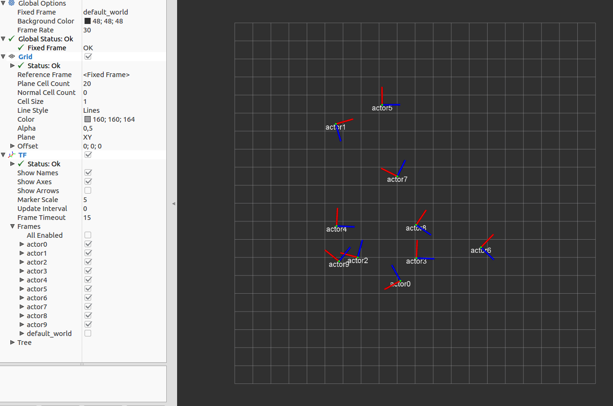
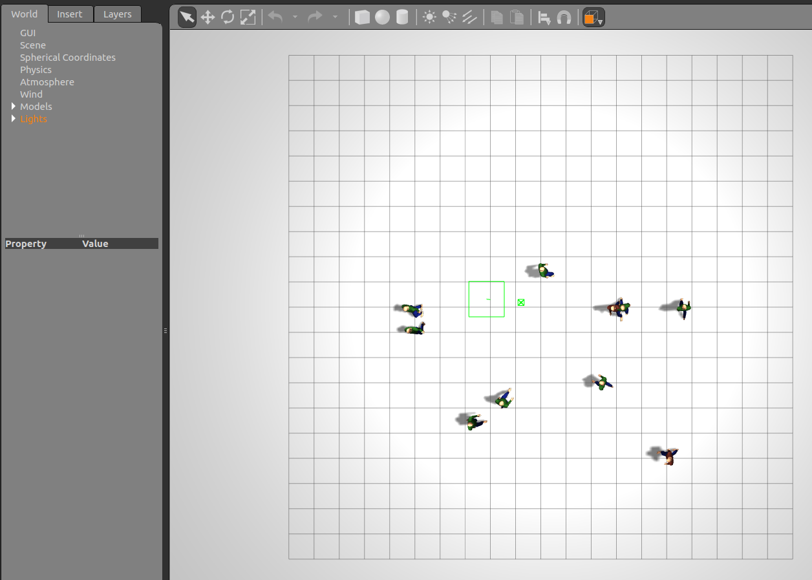

# A ros gazebo plugin for pedestrians

This is a ros pkg for gazebo [actor](http://gazebosim.org/tutorials?tut=actor&cat=build_robot) plugin.

### Dependencies
* Ubuntu 16.04
* ROS-kinetic
* Gazebo 8 (with actor suport)
* python-lxml
* turtlebot3
* turtlebot3_msgs
* turtlebot3_simulations

### Build

1. Add the repositories of [Gazebo 8](http://gazebosim.org/tutorials?tut=install_ubuntu) and [ROS kinetic](http://wiki.ros.org/indigo/Installation/Ubuntu)    

2. Install Gazebo 8, Ros kinetic in buntu 16.04 and other dependencies.
```
sudo apt-get install ros-kinetic-desktop-full
sudo apt-get install ros-kinetic-gazebo8-ros-pkgs
```

3. Build packages
```
cd /path/to/workspace/src
git clone git@github.com:onlytailei/gym_ped_sim.git
catkin build
```




### Example
```
roslaunch turtlebot3_social default.launch
```

### Node Details
- **actor_plugin**    
  Build based on a [Gazebo official example](http://gazebosim.org/tutorials?cat=guided_i&tut=guided_i6). This node broadcasts the tf of every actor. [Social force model](http://vision.cse.psu.edu/courses/Tracking/vlpr12/HelbingSocialForceModel95.pdf) is applied in every actor to interactive with each other.

- **actor_services**    
  The python files help to create several gazebo sdf files quickly. There is a rviz file for visualization.

- **turtlebo3_social**    
  In our socially compliant pedestrian simulator, we collect data by mounting a depth sensor onto one of the pedestrians, to the height matching that of real-world setups. Then, the social force model, as described in the paper, is used to label each incoming depth
image with their corresponding social force.

- **data_collection**    
  To save the related dataset.

### Dataset
The collected [pedestrian navigation dataset](https://ram-lab.com/file/tai_icra_2018_dataset.zip) contains:
- depth image
- RGB image
- target 
- social force classification
- social force
- sum force

## Interactive interface
Please reference [gym_style_gazebo](https://github.com/onlytailei/gym_style_gazebo)


------

This is the reference implementation of the plugins and for the paper **Socially-compliant Navigation through Raw Depth Inputs with Generative Adversarial Imitation Learning**. 
If it helps your research, please cite:
```
@inproceedings{tai2018social,
    author={L. Tai and J. Zhang and M. Liu and W. Burgard},
    booktitle={2018 IEEE International Conference on Robotics and Automation (ICRA)}, 
    title={Socially Compliant Navigation Through Raw Depth Inputs with Generative Adversarial Imitation Learning}, 
    year={2018}, 
    pages={1111-1117}, 
    doi={10.1109/ICRA.2018.8460968}, 
    ISSN={2577-087X}, 
    month={May},
}
```

## References
[srl-freiburg/pedsim_ros](https://github.com/srl-freiburg/pedsim_ros)    
[social force model](http://vision.cse.psu.edu/courses/Tracking/vlpr12/HelbingSocialForceModel95.pdf)


